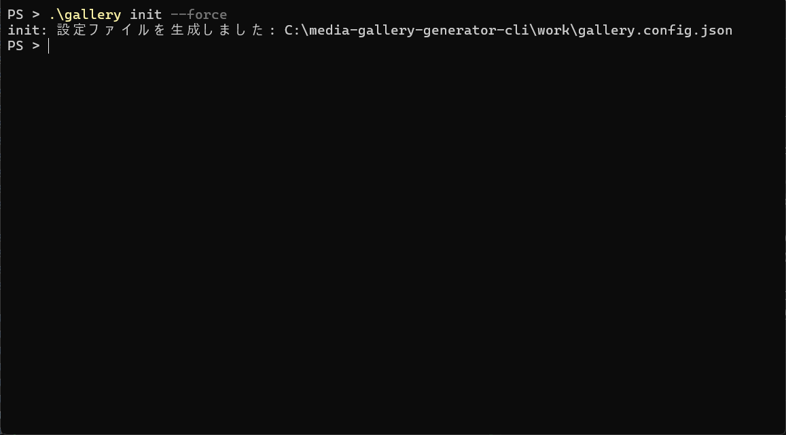
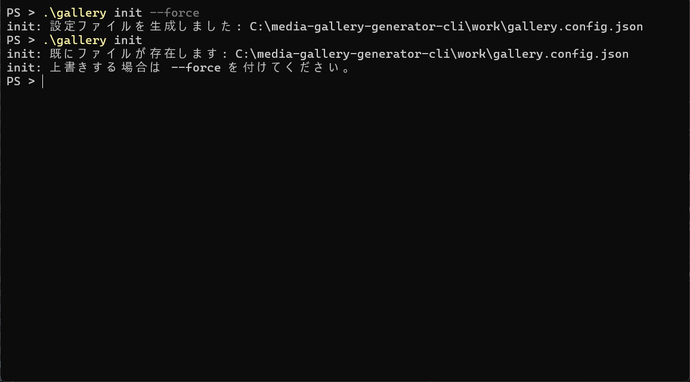
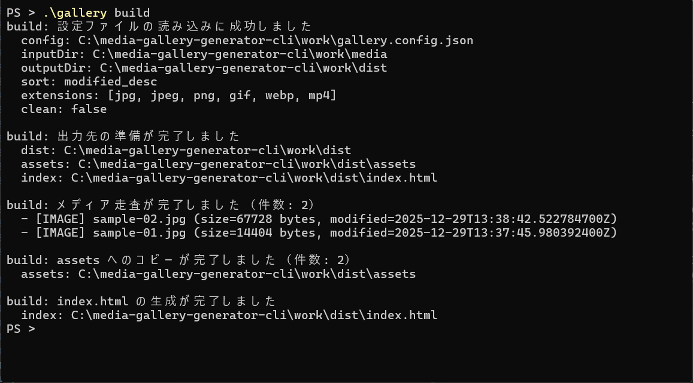
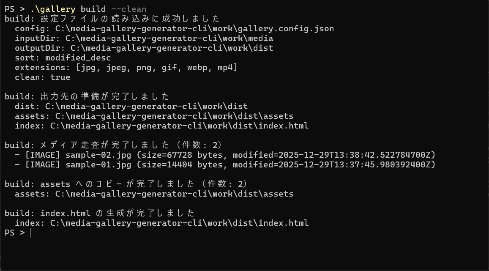
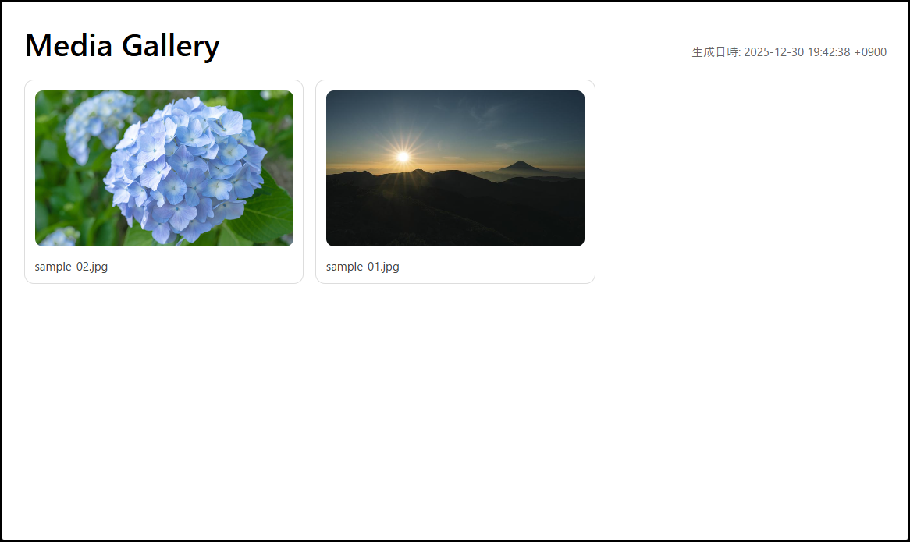

# Media Gallery Generator CLI

<p>
  
  
  
</p>

<p>
  
  
  
</p>

ローカルの `work/media/` 配下にある画像・動画を走査し、`work/dist/` に **静的なギャラリー（`index.html` + `assets/`）** を生成する CLI ツール。

- 設定ファイル：`work/gallery.config.json`
- 入力：`work/media/`
- 出力：`work/dist/`（`dist/assets/` に実体コピー）

---

## できること

- `work/media` を再帰走査して、画像/動画を一覧化
- `work/dist/index.html` を生成
- `work/dist/assets/` に実体コピー（相対構造を維持）
- 0 件のときは「メディアがありません」表示

---

## スクリーンショット

1. `--help` コマンド
   

2. `init --force` コマンド
   

3. `init` コマンド
   

4. `build` コマンド
   

5. `build --clean` コマンド
   

6. 生成される `index.html`
   

---

## クイックスタート

プロジェクト直下で実行する。

### 1) 設定ファイルを生成

```powershell
.\gallery init
```

- 既に `work/gallery.config.json` がある場合は失敗する

上書きするなら：

```powershell
.\gallery init --force
```

### 2) メディアを置く

`work/media/` 配下に画像/動画（例：jpg/png/mp4）を配置する。

### 3) 生成（HTML + assets）

```powershell
.\gallery build --clean
```

生成後、`work/dist/index.html` をブラウザで開いて確認する。

---

## 実行方法

Windows では `.cmd` を同梱しているため、以下で実行できる。

### ラッパー経由（gallery.cmd）

```powershell
.\gallery --help
.\gallery init
.\gallery build --clean
```

`gallery.cmd` は内部でプロジェクト直下へ移動し、Maven で起動する。

---

## コマンド仕様

### `init`（設定ファイル生成）

```powershell
.\gallery init
```

オプション：

- `--path <path>`  
  出力先（省略時：`./work/gallery.config.json`）
- `--force`  
  既存ファイルがあっても上書きする

例：

```powershell
.\gallery init --path ./work/gallery.config.json
.\gallery init --force
```

### `build`（HTML 生成 + assets コピー）

```powershell
.\gallery build
```

オプション：

- `--config <path>`  
  設定ファイル（省略時：`./work/gallery.config.json`）
- `--clean`  
  ビルド前に `dist` を削除してから生成する

例：

```powershell
.\gallery build --clean
.\gallery build --config ./work/gallery.config.json
```

---

## 設定ファイル仕様（gallery.config.json）

`gallery init` で生成されるデフォルト例：

```json
{
  "title": "Media Gallery",
  "inputDir": "./media",
  "outputDir": "./dist",
  "includeExtensions": ["jpg", "jpeg", "png", "gif", "webp", "mp4"],
  "sort": "modified_desc"
}
```

### 各キー

- `title`（string）  
  生成する HTML のタイトル/見出し
- `inputDir`（string）  
  入力ディレクトリ（相対パス OK）
- `outputDir`（string）  
  出力ディレクトリ（相対パス OK）
- `includeExtensions`（string[]）  
  対象拡張子（内部で `.` 除去・小文字化などを正規化）
- `sort`（string）  
  ソート指定（例：`modified_desc`）

---

## 出力仕様（dist）

`outputDir`（デフォルト：`work/dist`）配下に生成される。

- `dist/index.html`  
  ギャラリー本体（テンプレに `{{TITLE}}`, `{{GENERATED_AT}}`, `{{ITEMS}}` を差し込み）
- `dist/assets/`  
  入力ファイルの実体コピー先（相対構造維持）

### `--clean` について

`--clean` を付けると、ビルド前に `outputDir` を削除して作り直す。  
事故防止のため、安全条件を満たさないパスは削除しない設計。

---
